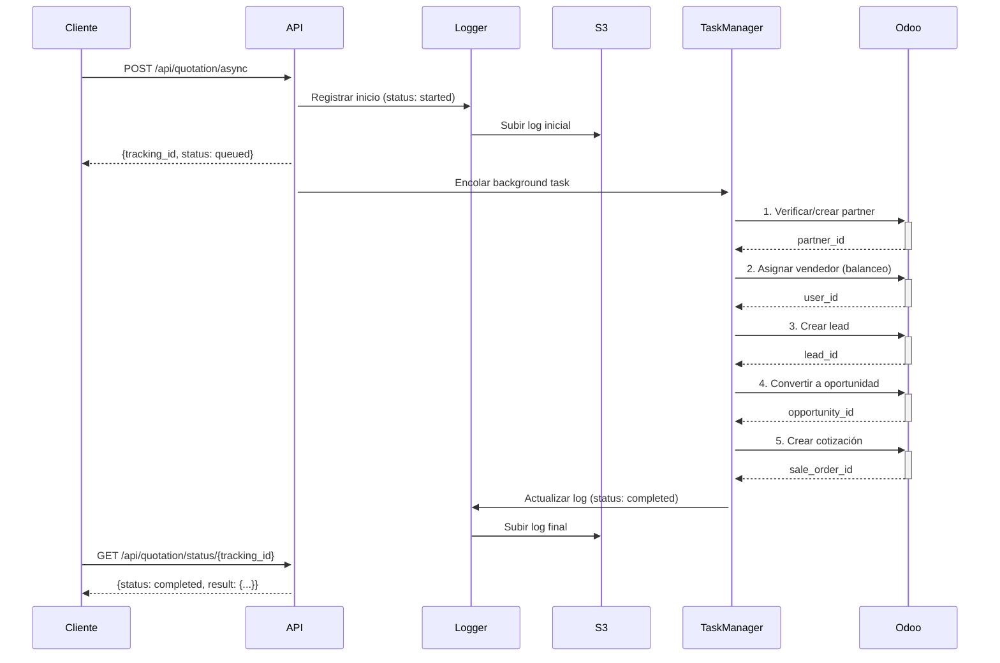

# MCP-Odoo Server

Servidor híbrido que combina **Model Context Protocol (MCP)** y **FastAPI** para integración completa con Odoo ERP.

## 🎯 Características

- 🔄 **API Asíncrona** - Cotizaciones en background con FastAPI
- 🔍 **MCP Tools** - Búsqueda y gestión de proyectos, tareas, CRM, ventas
- � **Logging Automático** - Registro JSON de operaciones con subida a S3
- 🐳 **Docker Ready** - Configuración lista para contenedores
- ⚡ **Dual Protocol** - MCP para IA + REST API para clientes

## 🚀 Inicio Rápido

### 1. Configurar `.env`

```bash
# Odoo Producción (solo lectura)
ODOO_URL=https://pegasuscontrol.odoo.com
ODOO_DB=pegasuscontrol-pegasuscontrol-10820611
ODOO_LOGIN=tu_email@ejemplo.com
ODOO_API_KEY=tu_api_key

# Odoo Desarrollo (escritura)
DEV_ODOO_URL=https://pegasuscontrol-dev18-25468489.dev.odoo.com
DEV_ODOO_DB=pegasuscontrol-dev18-25468489
DEV_ODOO_LOGIN=tu_email@ejemplo.com
DEV_ODOO_API_KEY=tu_api_key

# AWS S3 para Logs
S3_LOGS_BUCKET=ilagentslogs
AWS_REGION=us-west-2

# Server
PORT=8000
```

### 2. Instalar y Ejecutar

```bash
# Instalar dependencias
pip install -e .

# Ejecutar servidor (unbuffered para logs en tiempo real)
python -u server.py > /tmp/mcp_server.log 2>&1 &

# Verificar
curl http://localhost:8000/api/health
```

### 3. Usar API

```bash
# Crear cotización asíncrona
curl -X POST http://localhost:8000/api/quotation/async \
  -H "Content-Type: application/json" \
  -d '{
    "partner_name": "Company SA",
    "contact_name": "Juan Pérez",
    "email": "juan@company.com",
    "phone": "+52 55 1234 5678",
    "lead_name": "Nuevo Lead",
    "product_id": 26174,
    "product_qty": 1
  }'

# Respuesta: {"tracking_id": "quot_xxx", "status": "queued", ...}

# Consultar estado
curl http://localhost:8000/api/quotation/status/quot_xxx
```

## 📊 Endpoints Principales

### FastAPI (Async)
- `POST /api/quotation/async` - Crear cotización asíncrona
- `GET /api/quotation/status/{id}` - Consultar estado
- `GET /api/health` - Health check
- `GET /docs` - Swagger UI

### MCP Protocol
- `POST /mcp` - Protocolo MCP para herramientas síncronas

## 📁 Estructura del Proyecto

```
mcp-odoo/
├── server.py              # Punto de entrada (FastMCP + FastAPI)
├── core/                  # Módulos principales
│   ├── config.py         # Configuración y variables de entorno
│   ├── odoo_client.py    # Cliente Odoo XML-RPC
│   ├── api.py            # FastAPI endpoints asíncronos
│   ├── tasks.py          # Task manager para background jobs
│   └── logger.py         # Sistema de logging con S3
├── tools/                 # MCP Tools (CRM, sales, projects, etc.)
├── docs/                  # 📚 Documentación completa
│   ├── README.md         # Índice de documentación
│   ├── LOGGING.md        # Sistema de logs
│   ├── S3_LOGS_SETUP.md  # Setup AWS S3
│   └── IMPLEMENTATION.md # Resumen de implementación
├── examples/              # Scripts de prueba
│   └── test_s3_logs.sh   # Demo de logging
├── ARCHITECTURE.md        # Arquitectura detallada
└── pyproject.toml        # Dependencias

```

## 🏗️ Arquitectura

```
┌─────────────────┐
│   Clientes      │
│  (IA/Frontend)  │
└────────┬────────┘
         │
    ┌────▼─────┐
    │  FastAPI │ ← Async API (cotizaciones)
    │   +MCP   │ ← Sync Tools (búsqueda, lectura)
    └────┬─────┘
         │
    ┌────▼─────────┐
    │ Task Manager │ ← Background Jobs
    └────┬─────────┘
         │
    ┌────▼──────┐
    │  Logger   │ ← JSON logs → S3
    └────┬──────┘
         │
    ┌────▼─────┐
    │   Odoo   │ ← XML-RPC
    │ Dev/Prod  │
    └──────────┘
```

### Flujo de Cotización Asíncrona



## 📚 Documentación

Toda la documentación está organizada en **[docs/](docs/)**:

- **[docs/README.md](docs/README.md)** - 📑 Índice completo de documentación
- **[ARCHITECTURE.md](ARCHITECTURE.md)** - 🏗️ Arquitectura del sistema
- **[docs/LOGGING.md](docs/LOGGING.md)** - 📝 Sistema de logs automático
- **[docs/S3_LOGS_SETUP.md](docs/S3_LOGS_SETUP.md)** - ☁️ Configuración AWS S3

**Ver también:** [docs/REORGANIZATION.md](docs/REORGANIZATION.md) - Guía de reorganización

## 🧪 Testing

```bash
# Demo completa de logging
./examples/test_s3_logs.sh

# Health check
curl http://localhost:8000/api/health

# Ver logs del servidor
tail -f /tmp/mcp_server.log

# Ver logs de cotizaciones
ls -lh /tmp/mcp_odoo_logs/
cat /tmp/mcp_odoo_logs/2025-12-22_quot_xxx.log | python -m json.tool
```

## � Sistema de Logging

Cada operación se registra automáticamente en JSON:

```json
{
  "tracking_id": "quot_xxx",
  "timestamp": "2025-12-22T10:48:40.405304",
  "status": "completed",
  "input": { ... },
  "output": {
    "partner_id": 124253,
    "lead_id": 27409,
    "sale_order_id": 18689,
    "sale_order_name": "S15428"
  },
  "error": null
}
```

**Ubicación:**
- Local: `/tmp/mcp_odoo_logs/YYYY-MM-DD_tracking_id.log`
- S3: `s3://ilagentslogs/mcp-odoo-logs/YYYY/MM/`

Ver [docs/LOGGING.md](docs/LOGGING.md) para más detalles.

## 🐳 Docker

```bash
# Build
docker build -t mcp-odoo .

# Run
docker run -p 8000:8000 --env-file .env mcp-odoo
```

## 🔧 Desarrollo

```bash
# Instalar en modo desarrollo
pip install -e .

# Ejecutar con recarga automática
uvicorn server:app --reload --port 8000

# Ver logs en tiempo real
tail -f /tmp/mcp_server.log | grep -E "Log guardado|subido a S3"
```

## 📦 Dependencias

- **fastapi** - Framework web asíncrono
- **uvicorn** - Servidor ASGI
- **mcp** - Model Context Protocol SDK
- **boto3** - AWS SDK para subida de logs
- **pydantic** - Validación de datos
- **python-dotenv** - Manejo de variables de entorno

## 🤝 Contribuir

1. Lee [ARCHITECTURE.md](ARCHITECTURE.md) para entender el diseño
2. Consulta [docs/](docs/) para guías específicas
3. Crea tus cambios en una branch
4. Asegúrate de que los tests pasen
5. Crea un Pull Request

## 📄 Licencia

MIT

## 🔗 Links

- **API Docs:** http://localhost:8000/docs
- **Repo:** https://github.com/BravoMorteo/Daniel_Agent_Project


## 🔄 Flujo de Datos

```
Cliente MCP (ej: Claude Desktop)
            ↓
      [server.py]
            ↓
      Init Tools
            ↓
    [tools/*.py]
            ↓
   [OdooClient]
            ↓
     XML-RPC
            ↓
      Odoo ERP
```

## 📝 API Endpoints

### HTTP
- `GET /health` - Health check (para Docker/AWS)
- `POST /mcp` - Endpoint MCP (Streamable HTTP)

### MCP Tools

Todos los tools disponibles se cargan automáticamente desde `tools/`.

**Ejemplo de uso (búsqueda):**
```json
{
  "tool": "search",
  "arguments": {
    "query": "proyectos de desarrollo",
    "limit": 10
  }
}
```

**Respuesta:**
```json
{
  "content": [{
    "type": "text",
    "text": "{\"results\": [{\"id\": \"project:1\", \"title\": \"Project · Desarrollo Web\", \"url\": \"...\"}]}"
  }]
}
```

## 🔌 Integración con Claude Desktop

1. Editar `claude_desktop_config.json`:

```json
{
  "mcpServers": {
    "odoo": {
      "command": "python",
      "args": ["/ruta/a/mcp-odoo/server.py"],
      "env": {
        "ODOO_URL": "https://tu-odoo.com",
        "ODOO_DB": "tu_db",
        "ODOO_LOGIN": "tu_login",
        "ODOO_API_KEY": "tu_key"
      }
    }
  }
}
```

2. Reiniciar Claude Desktop

3. Los tools de Odoo estarán disponibles en la interfaz

## 🧪 Testing

```bash
# Ejecutar tests (si existen)
pytest

# Test manual de conexión
python -c "from core import OdooClient; c = OdooClient(); print(c.search('res.users', [], 1))"
```

## 🔐 Seguridad

- Nunca commitear el archivo `.env`
- Las API keys deben mantenerse secretas
- El servidor debe ejecutarse en red privada o con autenticación

## 📦 Dependencias

- `fastmcp` - Framework MCP
- `python-dotenv` - Carga variables de entorno
- `uvicorn` - Servidor ASGI

## 🛠️ Desarrollo

### Agregar Nuevos Tools

1. Crear archivo en `tools/nuevo_tool.py`:

```python
def register(mcp, deps):
    @mcp.tool(name="mi_tool", description="...")
    def mi_tool(arg: str) -> dict:
        odoo = deps["odoo"]
        # ... lógica
        return {"result": "..."}
```

2. Los tools se cargarán automáticamente

### Estructura de un Tool

```python
def register(mcp, deps):
    """
    mcp: Instancia de FastMCP
    deps: {"odoo": OdooClient}
    """
    
    @mcp.tool(name="nombre", description="Descripción")
    def tool_function(param: type) -> dict:
        odoo = deps["odoo"]
        # Implementación
        return resultado
```

## 📚 Recursos

- [MCP Documentation](https://modelcontextprotocol.io/)
- [Odoo XML-RPC API](https://www.odoo.com/documentation/17.0/developer/reference/external_api.html)
- [FastMCP](https://github.com/jlowin/fastmcp)

## 🐛 Debug

Ver logs del servidor:
```bash
python server.py
```

Los logs mostrarán:
- `[INFO]` - Información general
- `[WARN]` - Advertencias (ej: variables faltantes)
- `[ERROR]` - Errores

## 📊 Monitoreo

El endpoint `/health` devuelve el estado del servidor:
```bash
curl http://localhost:8000/health
# {"ok": true}
```

---

**Última actualización:** 15 de diciembre de 2025
